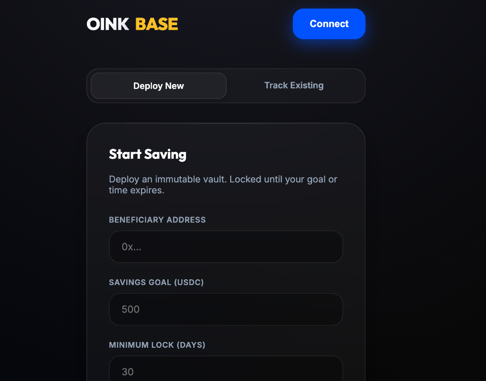

# 🐷 OINK BASE: Your USDC Piggy Bank

**The most secure, immutable, and decentralized way to save USDC on Base.**

OINK BASE is a serverless, "set-it-and-forget-it" savings vault. Once you deploy your piggy bank, the logic is locked into the blockchain. **No one—not even the creators—can change the rules or touch your funds.**

## ✨ Why OINK BASE?

-   **🔒 Bulletproof Security**: Built on the Base network (Coinbase's Layer 2). Funds are held in a smart contract with NO "owner" or "admin" keys.
-   **💎 True Immutability**: The contract cannot be deleted, modified, or "upgraded". Your savings goals are enforced by math, not people.
-   **🚀 Zero Fees**: We take 0% of your savings. You only pay standard Base network gas fees (pennies).
-   **🦊 MetaMask Native**: Works directly in your browser with MetaMask or any EVM wallet. No accounts, no emails, no KYC.

---

## 🛠 How It Works

### 1. Set Your Goal
Choose who receives the funds (the **Beneficiary**), how much you want to save (**Target Goal**), and how long you want to lock it (**Duration**). 

### 2. Deploy Your Vault
Click "Deploy" to create your personal piggy bank on the blockchain. You will receive a unique **Vault Address**. Save this address!

### 3. Save USDC
Send USDC to your Vault Address at any time. You can use the "Track" tab in our dashboard to watch your progress.

### 4. Automatic Release
Your funds are automatically released to the Beneficiary when **either** of these conditions are met:
-   The **Target Goal** is reached.
-   The **Minimum Lock Time** has passed.

> [!NOTE]
> If you reach your goal early or the time expires, anyone can click the **"Release Funds"** button on the dashboard to trigger the payout to the beneficiary.

---

## 🛡️ Security Guarantees

OINK BASE is designed for maximum safety:
1.  **No Ownership**: Once deployed, the contract is autonomous. There is no `owner` variable and no `onlyOwner` functions.
2.  **No Deletion**: The code contains no `selfdestruct` mechanism. It will exist as long as the Base network exists.
3.  **Strict Release**: Funds can ONLY be sent to the pre-defined Beneficiary address. There is no function to send funds anywhere else.
4.  **Sweeping Logic**: Any USDC sent directly to the contract address is automatically included in the final release.

---

## 🚀 Getting Started

1.  Open `dashboard.html` in your browser.
2.  Connect your MetaMask wallet.
3.  Switch to the **Base Mainnet**.
4.  Start saving!

---

*Disclaimer: OINK BASE is a decentralized tool. Always verify the Vault Address before sending large amounts of USDC. We are not responsible for lost private keys.*
